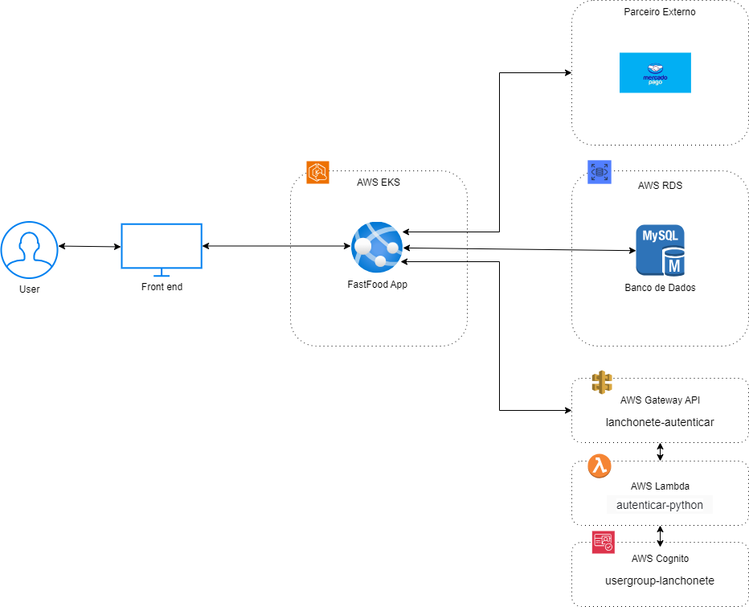

# Tech Challenge - FIAP TECH 2024

Este repositório contém o código fonte da infraestrutura em Terraform com K8s desenvolvida para o projeto do Tech Challenge referente a pós-graduação da FIAP TECH no ano de 2024:

## Arquitetura


## Stack utilizada

**Infra:** Terraform e K8s

## Rodando localmente

Clone o projeto:

```bash
  git clone https://link-para-o-projeto
```

Entre no diretório do projeto:

```bash
  cd ftc3-terra-k8s
```

Instale as dependências e módulos do diretório com o Terraform:

```bash
  terraform init
```

Execute o comando de `plan` para criar um preview das alterações:

```bash
  terraform plan
```

Execute o comando de `apply` para aplicar as alterações e subir a aplicação:

```bash
  terraform apply
```

## Documentação

Este repositório contém uma infraestrutura Kubernetes provisionada via Terraform. A seguir, a estrutura de pastas do projeto e uma breve descrição de cada módulo.

### Estrutura de Pastas

### k8s/

Esta pasta contém a configuração Kubernetes principal, separada em diferentes arquivos para facilitar a manutenção e a organização da infraestrutura.

-  **configs.tf**: Define as configurações necessárias para a aplicação, como variáveis de ambiente ou configurações específicas de serviços.
-  **deployments.tf**: Contém as definições de deployments do Kubernetes para as aplicações e serviços.
-  **namespaces.tf**: Gerencia a criação de namespaces para isolar os recursos dentro do cluster Kubernetes.
-  **services.tf**: Define os serviços do Kubernetes, responsáveis por expor as aplicações e garantir a comunicação entre os pods.

### modules/

Esta pasta contém os módulos reutilizáveis para provisionar diferentes componentes da infraestrutura de forma modular.

-  **autoscalling/**: Configura o autoscaling para os grupos de nós (nodes) do EKS, permitindo ajuste automático da capacidade de acordo com a demanda.
-  **eks-cluster/**: Provisiona o cluster EKS (Elastic Kubernetes Service), incluindo configuração do plano de controle e integração com o IAM.
-  **java-app/**: Define o deployment, serviço e configuração do aplicativo Java que será executado no cluster Kubernetes.
-  **namespaces/**: Módulo responsável por criar e gerenciar namespaces no cluster Kubernetes, proporcionando isolamento para diferentes ambientes e serviços.
-  **nodes/**: Gerencia os nós de trabalho (worker nodes) do cluster EKS, incluindo a configuração de grupos de nós e roles do IAM.
-  **pdb/**: Implementa as políticas de interrupção de pods (Pod Disruption Budget), garantindo disponibilidade mínima das aplicações durante eventos de escalabilidade ou manutenção.
-  **replicaset/**: Configura os ReplicaSets para garantir que um número definido de réplicas de pods esteja sempre disponível.

### Arquivos na raiz

-  **main.tf**: Arquivo principal do Terraform que orquestra a criação da infraestrutura e integra os diferentes módulos do projeto.
-  **readme.md**: Este arquivo, contendo a documentação do projeto.

## Autores

-  [@Bruno Campos](https://github.com/brunocamposousa)
-  [@Bruno Oliveira](https://github.com/bgoulart)
-  [@Diógenes Viana](https://github.com/diogenesviana)
-  [@Filipe Borba](https://www.github.com/filipexxborba)
-  [@Rhuan Patriky](https://github.com/rhuanpk)

